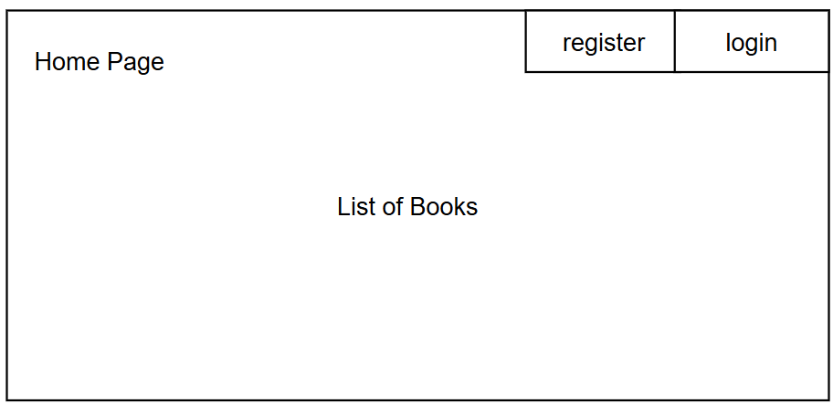
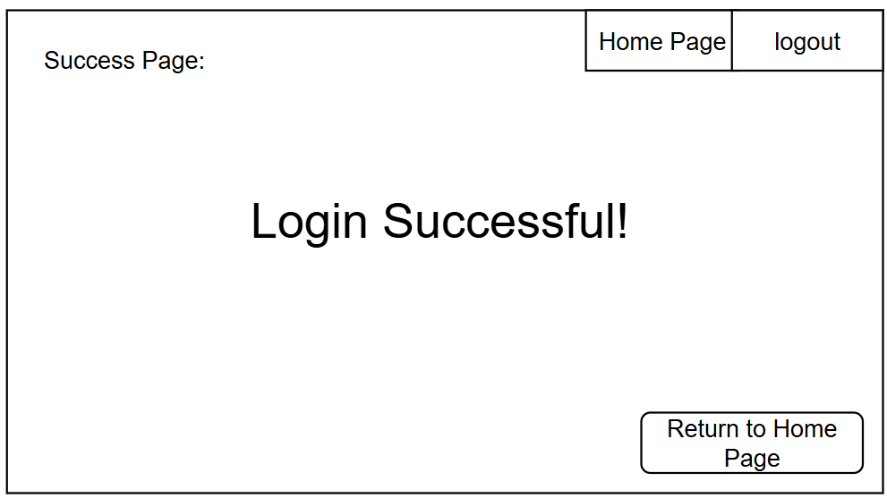
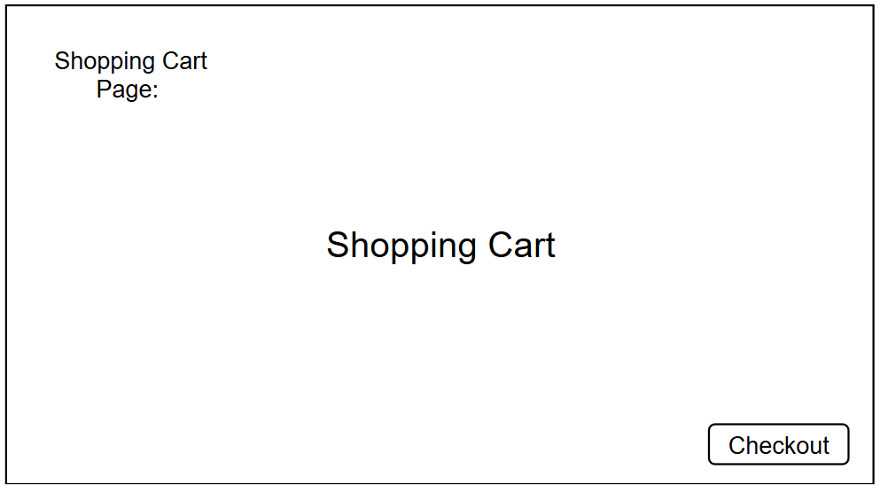
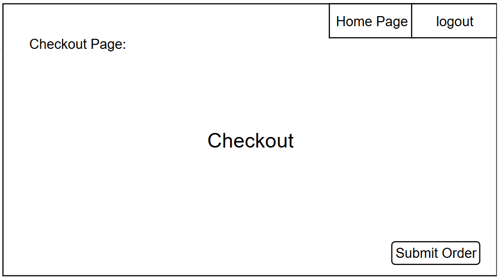
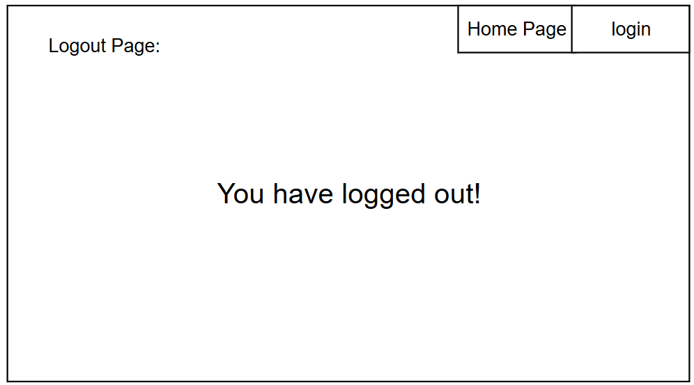
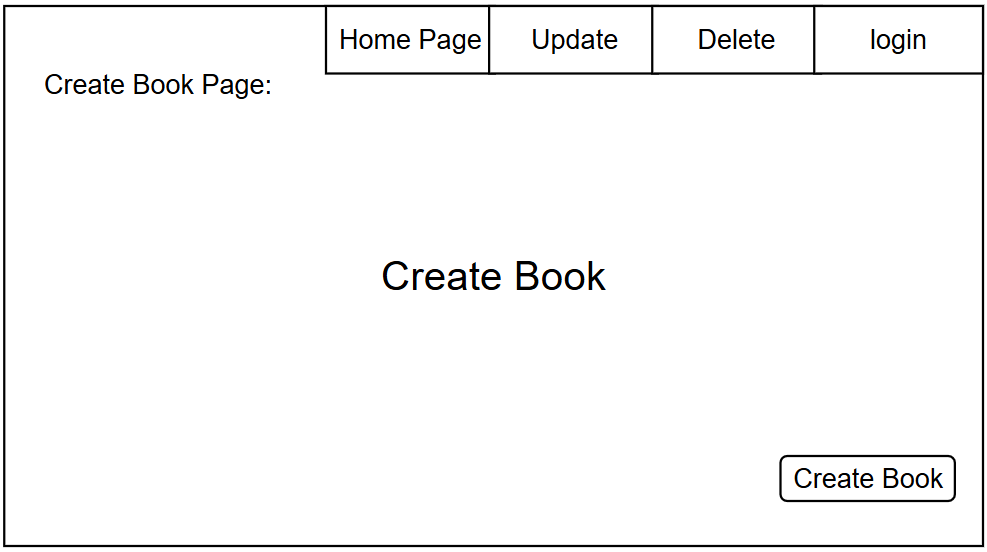
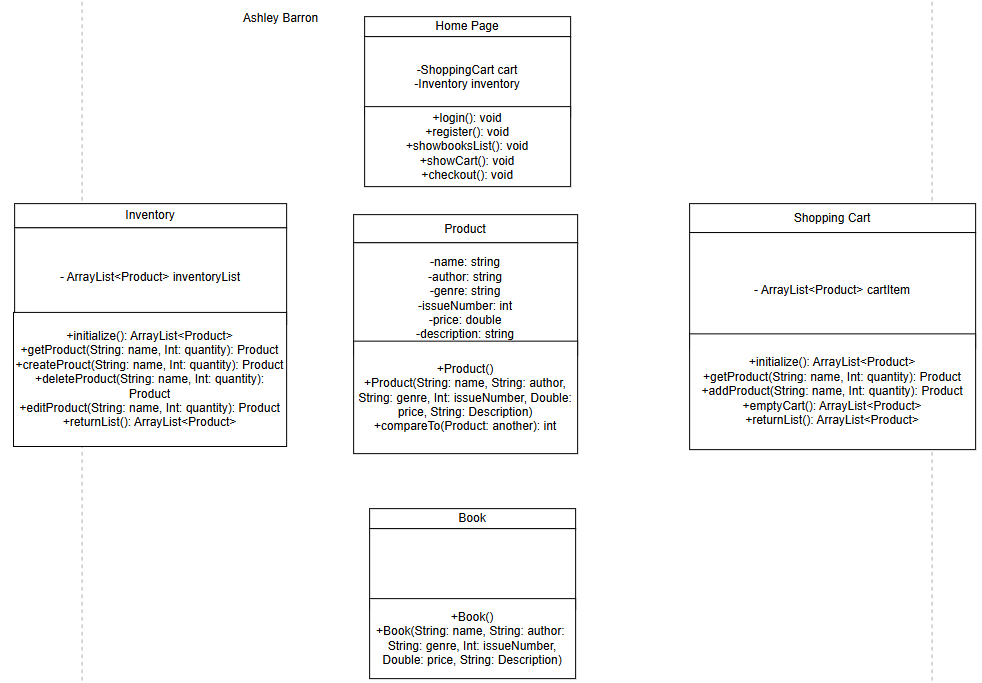

# CST-339 Programming in Java III
## Project Status and Design Report

- Topic:
    - Scope of Project

    - More information if needed.

- Date: 2025-04-24

- Revision: 5.0
### Team:
1. Ashley Barron
2. Trevor Marr

### Weekly Team Status Summary (UseCase)

- *This week we....

### GIT URL
- The git URL that can be used to clone your code and design artifacts

### Screencast URL:
- The URL that can be used to access your screencast demonstration video for the respective assignment

[Screencast] (https://youtu.be/7Im9HVVB8Js)

**REST API DOCUMENTATION AT THE BOTTOM OF PROJECT REPORT**

### Peer Review:
- [x]  We acknowledge that our team has reviewed this Report and we agree to the approach we are all taking


## Planning Documentation
### Initial Planning:
- *For milestone 8, ....

### Retrospective Results:
The following table should be completed after each Retrospective on things that went well (keep doing)
<br>
<br>

| *What Went Well |
| --------------- |
| N/A |


The following table should be completed after each Retrospective on things that didn’t go well (stop doing) and what would be done differently next time with an action plan to improve (try doing and continuous improvement)

| *What Did Not Go Well | Action Plan | Due Date  |
| -------------------- | ----------- | --------- |
| N/A | N/A  | April 27 |

## Design Documentation
### Install Instruction
- Software Requirements:
  - IDE: Visual Studio Code(make sure it's installed for editing project report & running project)
  - Database: MySql Server (make sure it's installed & running)
  - Java Development Kit (JDK) Version 11 or higher (make sure it's properly installed)

  - Steps:
    - Have main class to run milestone
    - Create Models for login, registration, & books
    - Create html classes for login, registration, index, dashboard, & error(preferable)
    - Create Controllers for login, registration, & main pages
    - Create registration service class for future milestone
    - Add logo
    - Add CSS to site

### General Technical Approach:
Add data here.
- The App needs:
  - a database of books.
  - the same database of users with user info
    - Two different types of users:
      - Admins have access to CRUD operations.
      - Customers have access to view the inventory, adding and removing from the book bag, and to checkout.


### Key Technical Design Decisions:
- Spring Boot: Spring tools help Java development effiecency. 
- MySQL: To manage databases
- Postman: enviornment for API development

### Known Issues:
Any anomalies or known issues in the code or functionality should be documented here


### Risks:
- **Time Constraints:** Balancing the project timeline alongside other academic responsibilities could be challenging. Unforeseen issues may increase the risk of missing deadlines.  
- **Team Collaboration:** Ineffective communication or coordination within the team could lead to delays in integration and slower progress.  
- **Database Integration:** Integrating the database into the project presents potential challenges, including schema design issues or compatibility problems with the relational database.  
- **Learning Curve:** As the project relies on gradually learning and applying Spring Boot features, unfamiliarity with the framework could lead to difficulties in handling errors, setting up CRUD operations, and ensuring smooth implementation. 


### ER Diagram


### DDL Scripts:
- https://github.com/trevormarrr/cst339-milestone/tree/main/milestone1/ddl-scripts

### Sitemap Diagram:


### User Interface Diagrams:











### Class Diagrams:


# Service API Design

## User Authentication


### **POST /auth/login**  
Authenticate the user and provide a token.


**Request Body**  
```json
{
  "username": "username",
  "password": "Password123!",
}
```

**Response**  
```json
{
  "token": "tkHjfnscHg7jfqg11NiIsInR5cCI6IkpXVCJ9..."
}
```

---

### **POST /auth/register**  
Register a new user.

**Request Body**  
```json
{
  "firstName": "John",
  "lastName": "Appleseed",
  "username": "username",
  "email": "example@example.com",
  "password": "Password123!",
  "role": "Member"
}
```

**Response**  
```json
{
  "message": "User successfully registered",
  "userId": 1
}
```
``


## Book Management (Admin)

### **GET /books**  
Retrieve a list of all books.

**Response**  
```json
[
  {
    "id": 1,
    "title": "Book 1",
    "genre": "Sci-Fi",
    "author": "John Appleseed",
    "year": 2000,
    "checkedOut": true
  },
  {
    "id": 2,
    "title": "Book 2",
    "genre": "Fiction",
    "author": "Johnny Seedapple",
    "year": 2020,
    "checkedOut": false
  }
]
```


### **POST /books**  
Add a new book to the catalog (Admin only).

**Request Body**  
```json
{
  "title": "Book 3",
  "genre": "Non-Fiction",
  "author": "Old Apple John",
  "year": 2025,
  "checkedOut": false
}
```

**Response**  
```json
{
  "message": "Book added successfully",
  "id": 3
}
```


### **PUT /books/{id}**  
Update a book's details (Admin only).

**Path Parameter**  
`id`: The ID of the book to update.

**Request Body**  
```json
{
  "title": "Book 3",
  "genre": "Biography",
  "author": "Old Apple John",
  "year": 2023,
  "checkedOut": true
}
```

**Response**  
```json
{
  "message": "Book updated successfully"
}
```


### **DELETE /books/{id}**  
Delete a book from the catalog (Admin only).

**Path Parameter**  
`id`: The ID of the book to delete.

**Response**  
```json
{
  "message": "Book deleted successfully"
}
```


## Book Bag (User)


### **POST /cart**  
Add a book to the book bag.

**Request Body**  
```json
{
  "id": 1,
  "quantity": 1
}
```

**Response**  
```json
{
  "message": "Book added to Book Bag"
}
```


### **GET /cart**  
Retrieve the contents of the shopping cart.

**Response**  
```json
[
  {
    "id": 1,
    "title": "Book 1",
    "genre": "Sci-Fi",
    "author": "John Appleseed",
    "year": 2000,
    "checkedOut": true
  },
  {
    "id": 2,
    "title": "Book 2",
    "genre": "Fiction",
    "author": "Johnny Seedapple",
    "year": 2020,
    "checkedOut": false
  }
]
```
### **DELETE /cart/{bookId}**  
Remove a book from the book bag.

**Path Parameter**  
`bookId`: The ID of the book to remove.

**Response**  
```json
{
  "message": "Book removed from Book Bag"
}
```

## Error Responses

All error responses follow this JSON format:

**Response**  
```json
{
  "error": "Unauthorized",
  "message": "You are not allowed to perform this action"
}
```


### Security Design:

1. **Authentication Mechanism**

   - **Flow**  
     After a user types in their credentials, the system will verify them against the database and then grant an auth token.

   - **Credential Storage**  
     Credentials will be stored in the database and passwords will be hashed for encryption.

   - **Password Requirements**  
     - One uppercase letter
     - One lowercase letter
     - One special character  
     - One number

2. **Authorization Mechanism**
   - **Role-Based Access Control(RBAC)**  
     - Admin 
        - Create New Book
        - Update Book
        - Delete Book
        - View Inventory 
        - Login 
        - Register
     - User
        - View Books
        - Login
        - Register

3. **Security Features**
    - **Encryption**  
        - Password will be hashed before stored into database and data will be encrypted during transit using HTTPS
    - **RBAC**  
        - Users will be restricted specific actions whereas Admins will have the ability to do everything. 
     
### Other Documentation:
You should insert any additional drawings, storyboards, whiteboard pictures, project schedules, tasks lists, etc. that support your approach, design, and project. If you have no supporting documentation, please explain the rationale for why you are able to leave this section as N/A

# REST API Documentation

## API Overview
The following REST APIs have been implemented and secured with Spring Security using Basic HTTP Authentication:

### Product APIs

#### GET /api/products
Retrieves all products from the catalog.

**Authentication Required**: Basic Auth

**Response**
```json
[
  {
    "id": 1,
    "title": "Book 1",
    "genre": "Fiction",
    "author": "Author 1",
    "price": 29.99,
    "inStock": true
  },
  {
    "id": 2,
    "title": "Book 2",
    "genre": "Non-Fiction", 
    "author": "Author 2",
    "price": 19.99,
    "inStock": true
  }
]
```

**Error Response** (401 Unauthorized)
```json
{
  "error": "Unauthorized",
  "message": "Authentication required to access this resource"
}
```

#### GET /api/products/{id}
Retrieves a specific product by ID.

**Authentication Required**: Basic Auth

**Parameters**
- Path Parameter: id (integer) - Product ID

**Response**
```json
{
  "id": 1,
  "title": "Book 1",
  "genre": "Fiction",
  "author": "Author 1", 
  "price": 29.99,
  "inStock": true
}
```

**Error Responses**

401 Unauthorized:
```json
{
  "error": "Unauthorized",
  "message": "Authentication required to access this resource"
}
```

404 Not Found:
```json
{
  "error": "Not Found",
  "message": "Product with id {id} not found"
}
```

## Security Implementation

### Authentication
- Basic HTTP Authentication is implemented using Spring Security
- Credentials are validated against the user database
- All API endpoints require authentication

### Access Control  
- APIs are secured at the method level using Spring Security annotations
- User roles and permissions are enforced through Spring Security configuration
- Invalid credentials result in 401 Unauthorized responses

### API Testing
The APIs have been tested using Postman with the following scenarios:
- Accessing endpoints without authentication
- Accessing endpoints with invalid credentials
- Accessing endpoints with valid credentials
- Retrieving single and multiple products
- Error handling for invalid product IDs

